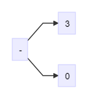
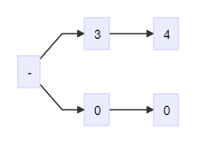
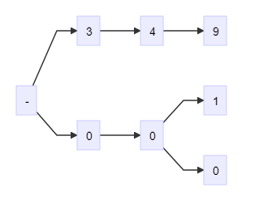
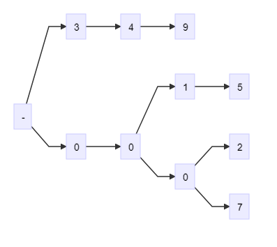

### 1. 使用LL算法构建AST | 四则运算
* **LL：**从左到右扫描，从左到右规约
* LL语法分析
  ```
  <Expression>::=
    <AdditiveExpression><EOF>//EOF end of file标识源代码的结束

  <AdditiveExpression>::=
    <MultiplicativeExpression>
    |<AdditiveExpression><+><MultiplicativeExpression>
    |<AdditiveExpression><-><MultiplicativeExpression>
  //加法表达式等于
  //  单独的乘法表达式
  //  或者加法表达式加上乘法表达式
  //  或者加法表达式减去乘法表达式

  <MultiplicativeExpression>::=
    <Number>
    |<MultiplicativeExpression><*><Number>
    |<MultiplicativeExpression></><Number>
  //乘法表达式等于
  //  单独的数字
  //  或者乘法表达式乘数字
  //  或者乘法表达式除数字

  //加法是由左右两个乘法组成
  //终结符 <+><-><*></><Number><EOF>
  ```
  以加法表达式为例：

  找到的第一个符号symbol需要将加法表达式中的乘法表达是展开，那么它可能是一个单独的乘法表达式、加法表达式或者一个数字。在以上三种情况下，如果第一个符号symbol是number或者乘法表达式不应该直接当成乘法处理，接续判断第二个输入的元素是加减还是乘除。

### 2. 使用LL算法构建AST | 正则表达式(regexp.html)
```
var regexp = /([0-9\.]+)|([ \t]+)|([\r\n]+)|(\*)|(\/)|(\+)|(\-)/g;
// 正则里面圆括号表示捕获
var dictionary = [
  "Number",
  "Whitespace",
  "LineTerminator",
  "*",
  "/",
  "+",
  "-",
];

function tokenize(source) {
  var result = null;
  while (true) {
    result = regexp.exec(source);

    if (!result) break;

    for (var i = 1; i <= dictionary.length; i++) {
      if (result[i]) console.log(dictionary[i - 1]);
    }
    console.log(result);
  }
}

tokenize("1024 + 10 * 25");
```

### 3. 使用LL算法构建AST | LL词法分析(lexicalAnalysis.html)

```
function* tokenize(source) {
  var result = null;
  var lastIndex = 0;
  while (true) {
    lastIndex = regexp.lastIndex;
    result = regexp.exec(source);

    if (!result) break;

    if (regexp.lastIndex - lastIndex > result[0].length) break;

    let token = {
      type: null,
      value: null,
    };

    for (var i = 1; i <= dictionary.length; i++) {
      if (result[i]) token.type = dictionary[i - 1];
    }
    token.value = result[0];
    yield token;
  }
  yield {
    type: "EOF",
  };
}

for (let token of tokenize("1024 + 10 * 25")) {
  console.log(token);
}
```

### 4. 使用LL算法构建AST | LL语法分析（一）(grammaticalAnalysis1.html)

### 5. 使用LL算法构建AST | LL语法分析（二）(grammaticalAnalysis2.html)

### 6. 字符串分析算法 | 总论
* 字典树----大量高重复字符串存储分析
* KMP-------在长字符串里找模式
* Wildcard--带通配符的字符串模式
* 正则------字符串通用模式匹配
* 状态机----通用的字符串分析
* LL LR-----字符串多层级结构分析

### 7. 字符串分析算法 | 字典树(trie.html)
3499
0015
0002
0007
| 位数 |   1   |   2   |   3   |   4   |
| ---- | :---: | :---: | :---: | :---: |
| 3499 |   3   |   4   |   9   |   9   |
| 0015 |   0   |   0   |   1   |   5   |
| 0002 |   0   |   0   |   0   |   2   |
| 0007 |   0   |   0   |   0   |   7   |
```graphLR
    A[-] --> B[3]
    A --> F[0]
```

```graphLR
    A[-] --> B[3]
    B --> C[4]
    A --> F[0]
    F --> G[0]
```

```graphLR
    A[-] --> B[3]
    B --> C[4]
    C --> D[9]
    A --> F[0]
    F --> G[0]
    G --> H[1]
    G --> I[0]
```

```graphLR
    A[-] --> B[3]
    B --> C[4]
    C --> D[9]
    A --> F[0]
    F --> G[0]
    G --> H[1]
    G --> I[0]
    H --> J[5]
    I --> K[2]
    I --> L[7]
```

### 8. 字符串分析算法 | KMP字符串模式匹配算法(KMP.js)

### 9. 字符串分析算法 | Wildcard(wildcard.html)

### function* yield
```
function* generator(i) {
  yield i;
  yield i + 10;
}

const gen = generator(10);

console.log(gen.next());
// Object { value: 10, done: false }

console.log(gen.next());
// Object { value: 20, done: false }
```
---
```
function* generator(i) {
  yield i;
  yield i + 10;
}

for(let i of generator(10)){
console.log(i)
}
//10
//20
```